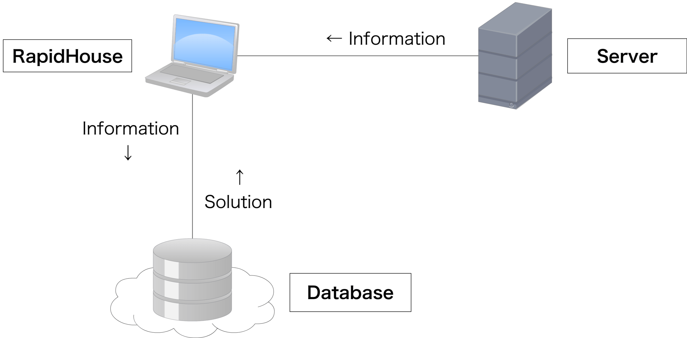

About
=====
This section explains RapidHouse.

--------
Overview
--------
RapidHouse is an automated tuning tool for a server application that use GA(Genetic Algorithm) as an algorithm for tuning.

RapidHouse is available to a server application such as Apache and MySQL that use a file for configuration.
RapidHouse tunes the server application by rewriting the configuration file, according to a template file.

The template file example as follows:

.. code-block:: none

   # Timeout	120
   Timeout	#{ myvar1 }
   # Timeout	#{ myvar1[min:max] }
   # KeepAliveTimeout	15
   # KeepAliveTimeout	#{ myvar2[0:] }
   KeepAliveTimeout	#{ myvar2[0:30] }

If you use RapidHouse, A performance of the server application might be the improvement as follows:

.. image:: Images/fig-2core-1gb.png
    :width: 50%
    :align: center

Let's use RapidHouse.

By the way, RapidHouse was published in `Programming Contest <http://www.procon.gr.jp/>`_.

------------------
Innovative feature
------------------
An innovative feature of RapidHouse is to use an own database by communicating with the internet.
The database has information that an approximate solution for the server application.

You quickly get the solution by the database.

If you didn't edit a program of RapidHouse, RapidHouse will send an information to the database.
The information includes following items.

  - about Hardware
     - CPU Vendor
     - CPU Product Name
     - CPU Arch
     - CPU Frequency
     - CPU Cores
     - Memory Size
  - about Software
     - Server Application Name
     - Benchmark Command(**Shouldn't include your password.**)
  - about Solution
     - Approximate Solution
     - Result of benchmark

You should cooperate to improve the database.

---------
Let's try
---------
| We prepared a base image for Vagrant that RapidHouse and WordPress are installed.
| http://rapidhouse.nitkc.org/vagrant/v0.0.1/rapidhouse.box
| http://rapidhouse.nitkc.org/vagrant/v0.0.1/Vagrantfile

This image is based on `2creatives/vagrant-centos CentOS 6.5 x86_64 Minimal <https://github.com/2creatives/vagrant-centos/releases/tag/v6.5.3>`_.
You use this image as follows:

.. code-block:: bash

   $ mkdir testdir
   $ cd testdir
   $ wget http://rapidhouse.nitkc.org/vagrant/v0.0.1/Vagrantfile
   $ vagrant up
   $ vagrant ssh
   [vagrant@vagrant-centos65 ~]$ cd rapidhouse
   [vagrant@vagrant-centos65 ~]$ sudo rapidhouse rapid_house.ini
   Score 9.88 KeepAliveTimeout=13....
   Score 10.1 KeepAliveTimeout=4.....
   Score 3.7 KeepAliveTimeout=32.....
   Score 1.87 KeepAliveTimeout=12....
     :
	 :
	 :
   ^C
   SIGINT
   [vagrant@vagrant-centos65 ~]$ ls /vagrant/
   Vagrantfile USAGI.log
   [vagrant@vagrant-centos65 ~]$ exit
   $ grep "\[score:best\]" USAGI.log | cut -d' ' -f3
   
I wish you the best.
But the best solution might have already derived by the database.
