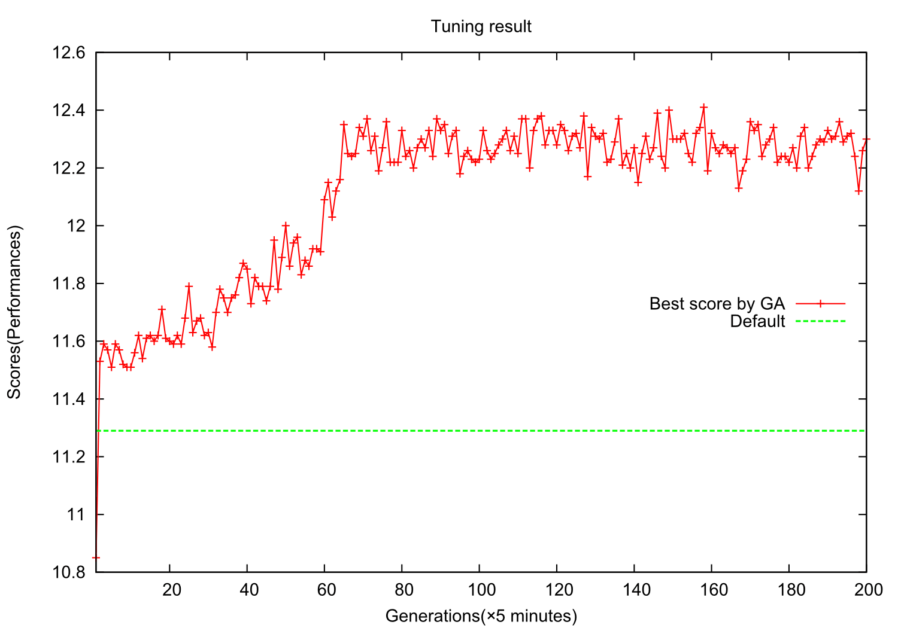

.. rapidhouse documentation master file, created by
   sphinx-quickstart on Thu Mar 19 16:42:11 2015.
   You can adapt this file completely to your liking, but it should at least
   contain the root `toctree` directive.

Welcome to RapidHouse's documentation!
======================================
RapidHouse is a automated tuning-tool for a server application that run on Python 2.7.x.

.. toctree::
   :maxdepth: 2

   tutorial
   rapidconfig
   tips
   Modules/modules

RapidHouse is available to a server application such as Apache and MySQL that use a file for configuration.
RapidHouse tune the server application by rewriting the configulation file according to a template file.
The template file example as follows:

.. code-block:: none

   # Timeout	120
   Timeout	#{ myvar1 }
   # Timeout	#{ myvar1[min:max] }
   # KeepAliveTimeout	15
   # KeepAliveTimeout	#{ myvar2[0:] }
   KeepAliveTimeout	#{ myvar2[0:30] }

If you use RapidHouse, A performance of the server application might be the improvement as follows:

Let's use RapidHouse.

Indices and tables
==================

* :ref:`genindex`
* :ref:`modindex`
* :ref:`search`

